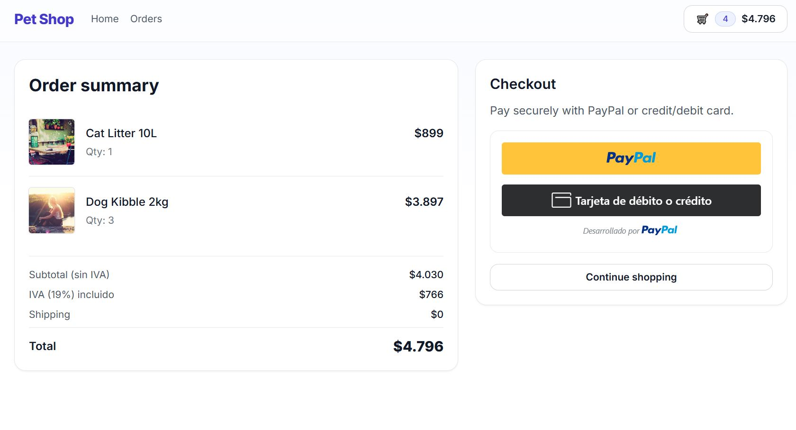
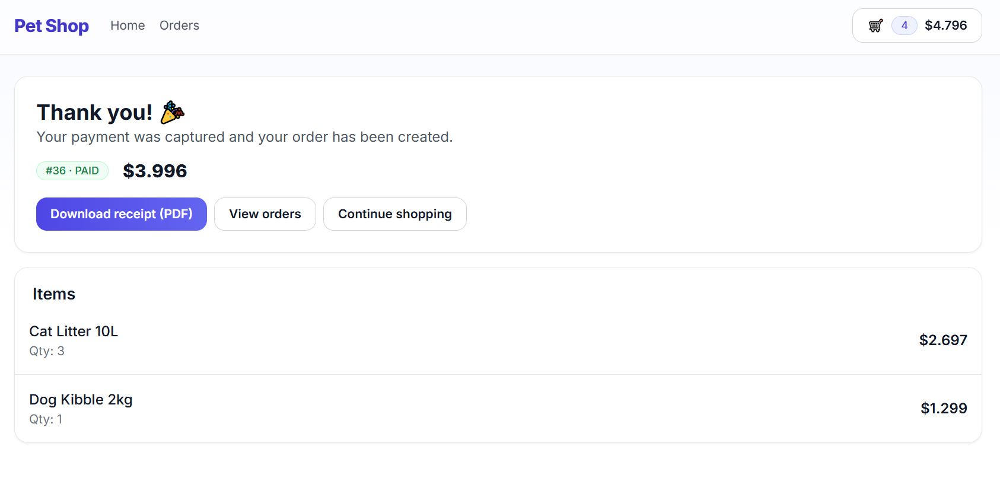

## 🇪🇸 `README.es.md` (Español – Portafolio)

```markdown
# 🛒 Ecommerce Mini (Demo de Portafolio)

Proyecto **fullstack de ecommerce** desarrollado como parte de mi portafolio para mostrar mis habilidades en backend y frontend.  
Simula una experiencia moderna de compra con carrito, checkout, integración de PayPal y gestión de órdenes.

🌐 Idiomas: [Inglés](README.md) | [Español](README.es.md)

## ⚡ Tecnologías

- **Backend (API)**
  - Node.js + Express
  - Prisma ORM + SQLite
  - PayPal Checkout SDK
  - Zod (validación)
  - Dotenv, CORS, Morgan

- **Frontend (Web)**
  - React + TypeScript + Vite
  - React Router
  - TailwindCSS
  - Context API (estado global del carrito)
  - Toasts personalizados
  - PayPal React SDK

## 🚀 Funcionalidades

- Catálogo de productos con página de detalle (PDP).
- Carrito persistente guardado en `localStorage`.
- MiniCart desplegable en el encabezado.
- Checkout con desglose claro:
  - Subtotal (sin IVA)
  - IVA (19%) incluido
  - Envío
  - Total final
- Pago con **PayPal** (sandbox).
- Página de **Thank You** con boleta en PDF descargable.
- Listado de órdenes y detalle individual.
- Toasts para feedback al usuario (agregar, actualizar, eliminar, pagar).
- UI responsiva y adaptada a móviles.

## ⚙️ Instalación

### 1. Clonar repo
```bash
git clone https://github.com/yourusername/ecommerce-mini.git
cd ecommerce-mini
````

### 2. Backend (API)

```bash
cd api
npm install
```

Variables de entorno (`.env`):

```env
PORT=4000
CORS_ORIGIN=http://localhost:5173
JWT_SECRET=change_me
DATABASE_URL="file:./dev.db"
## 🧪 Probando pagos con PayPal Sandbox

Este proyecto utiliza **PayPal Sandbox** para simular pagos reales durante el proceso de checkout.

- Puedes probar el flujo creando cuentas sandbox (comprador/vendedor) en tu [PayPal Developer Dashboard](https://developer.paypal.com/tools/sandbox/).

⚠️ **Importante**  
- Solo funcionan las cuentas sandbox en este demo.  
- Las credenciales reales de PayPal no procesarán pagos.  
- Tu `VITE_PAYPAL_CLIENT_ID` y `VITE_PAYPAL_CURRENCY` deben estar definidos en un archivo `.env` (este archivo nunca debe subirse a Git).  

# PayPal Sandbox
PAYPAL_CLIENT_ID=tu_client_id
PAYPAL_CLIENT_SECRET=tu_client_secret
PAYPAL_MODE=sandbox
BASE_URL=http://localhost:4000

```

Ejecutar migraciones y seed:

```bash
npx prisma migrate dev --name init
npx prisma db seed
```

Iniciar API:

```bash
npm run dev
```

### 3. Frontend (Web)

```bash
cd ../web
npm install
```

Variables de entorno (`.env`):

```env
VITE_API_URL=http://localhost:4000
VITE_PAYPAL_CLIENT_ID=tu_client_id
VITE_PAYPAL_CURRENCY=CLP
```

Iniciar frontend:

```bash
npm run dev
```

Frontend 👉 `http://localhost:5173`
API 👉 `http://localhost:4000`

## 📷 Capturas

* Catálogo
  

* Checkout
  

* Thank You
  

## 📄 Nota

Este es un **proyecto demo de portafolio** creado para mostrar habilidades de desarrollo fullstack.
No está pensado para uso en producción ni como documento tributario real.
