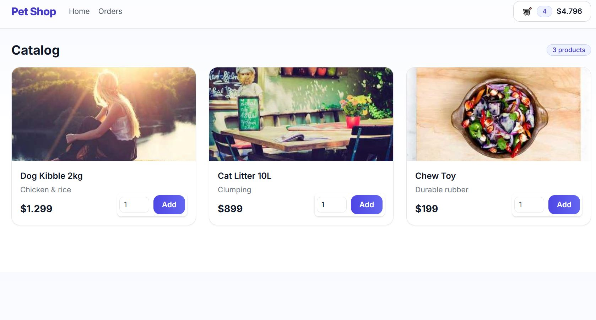

Perfecto 🙌 entonces le damos un tono más **profesional/portafolio**, no solo educativo. Te dejo las dos versiones listas:

---

## 🇬🇧 `README.md` (English – Portfolio style)

````markdown
# 🛒 Ecommerce Mini (Portfolio Demo)

A complete **fullstack ecommerce demo** built as part of my portfolio to showcase my skills in backend and frontend development.  
It demonstrates a modern shopping experience with cart, checkout, PayPal integration, and order management.

🌐 Languages: [English](README.md) | [Español](README.es.md)

## ⚡ Tech Stack

- **Backend (API)**
  - Node.js + Express
  - Prisma ORM + SQLite
  - PayPal Checkout SDK
  - Zod (validation)
  - Dotenv, CORS, Morgan

- **Frontend (Web)**
  - React + TypeScript + Vite
  - React Router
  - TailwindCSS
  - Context API (global cart state)
  - Custom toasts
  - PayPal React SDK

## 🚀 Features

- Product catalog with detail page (PDP).
- Persistent cart stored in `localStorage`.
- MiniCart dropdown in header.
- Checkout with clear breakdown:
  - Subtotal (without VAT)
  - VAT (19%) included
  - Shipping
  - Grand total
- Pay with **PayPal** (sandbox).
- **Thank You** page with downloadable PDF receipt.
- Orders list and individual order detail.
- Toasts for user feedback (add, update, remove, pay).
- Fully responsive and mobile-friendly UI.

## ⚙️ Setup

### 1. Clone repo
```bash
git clone https://github.com/leavals/ecommerce-mini
cd ecommerce-mini
````

### 2. Backend (API)

```bash
cd api
npm install
```

Environment variables (`.env`):

```env
PORT=4000
CORS_ORIGIN=http://localhost:5173
JWT_SECRET=change_me
DATABASE_URL="file:./dev.db"

## 🧪 Testing Payments with PayPal Sandbox

This project uses **PayPal Sandbox** to simulate real payments during checkout.

- You can test the flow by creating sandbox accounts (buyer/seller) in your [PayPal Developer Dashboard](https://developer.paypal.com/tools/sandbox/).

⚠️ **Important**  
- Only sandbox accounts work in this demo.  
- Real PayPal credentials will not process payments.  
- Your `VITE_PAYPAL_CLIENT_ID` and `VITE_PAYPAL_CURRENCY` must be set in a `.env` file (never commit this file to Git).  


# PayPal Sandbox
PAYPAL_CLIENT_ID=your_client_id
PAYPAL_CLIENT_SECRET=your_client_secret
PAYPAL_MODE=sandbox
BASE_URL=http://localhost:4000
```

Run migrations and seed:

```bash
npx prisma migrate dev --name init
npx prisma db seed
```

Start API:

```bash
npm run dev
```

### 3. Frontend (Web)

```bash
cd ../web
npm install
```

Environment variables (`.env`):

```env
VITE_API_URL=http://localhost:4000
VITE_PAYPAL_CLIENT_ID=your_client_id
VITE_PAYPAL_CURRENCY=CLP
```

Start frontend:

```bash
npm run dev
```

Frontend 👉 `http://localhost:5173`
API 👉 `http://localhost:4000`

## 📷 Screenshots

* Catalog
  

* Checkout
  

* Thank You
  

## 📄 Note

This is a **portfolio demo project** built to demonstrate fullstack development skills.
It is not intended for production or real fiscal use.

````

---

